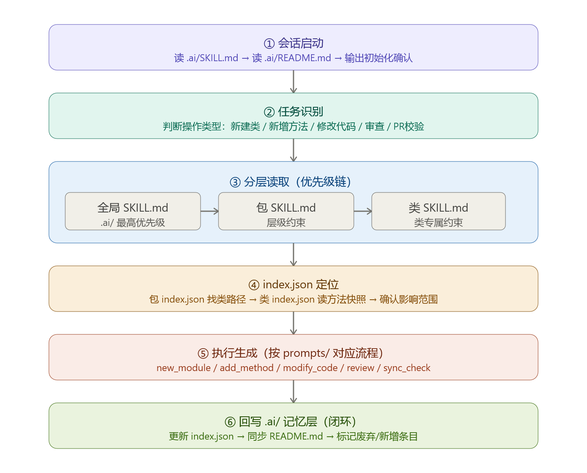

# AI Project-Level Restriction Prompts (Java) Demo

基于《阿里巴巴 Java 开发规范（嵩山版）》构建的 **AI 项目级限制提示词体系**，用于在 AI 参与代码生成、修改、审查等环节时，提供**一致性约束、结构化流程与质量保障机制**。


---

## 📌 项目目标

* 在大项目或者巨大项目时,上下文过大,降低 AI 输出不一致、风格漂移、规范违规等问题
* 将 Java 开发规范转化为 **AI 可执行约束（Prompts）**
* 在项目级别建立 **统一的生成/修改/审查规则**
* 构建 **可闭环的记忆与索引系统**

---

## 🧠 核心设计思想

本项目围绕以下关键机制构建：

1. **分层约束体系（SKILL.md）**
2. **索引驱动定位（index.json）**
3. **流程化执行（prompts）**
4. **记忆回写闭环（.ai/）**

---


## 🗂️ 目录结构

```bash
.
├── .ai/                        # AI 记忆层（全局约束 & 状态回写）
│   ├── SKILL.md                # 全局最高优先级规则
│   └──README.md                # AI 使用说明 & 初始化入口
│
├── com/                       # 业务模块
│   └── xxx-module/
│       ├── SKILL.md           # 模块级约束
│       ├── README.md          # 模块说明
│       └── index.json         # 模块索引（类/方法定位）
│
├── prompts/                     # 执行流程模板
│   ├── index_class.json         # 类级 index 模板
│   ├── index.json               # 包级 index 模板
│   ├── new_module.md            # 新建类流程
│   ├── add_method.md            # 新增方法流程
│   ├── modify_code.md           # 修改代码控制流程
│   ├── review.md                # 代码审查流程（基于阿里规范）
│   ├── advanced.md              # 批量初始化、废弃处理、重构场景
│   ├── session_init.md          # 会话初始化 — 每次对话开始时执行
│   └── sync_check.md            # PR 前一致性校验（基于阿里规范强制项）
│
└── README.md                  # 项目说明（当前文件）
```

## 🗂️ 目录结构（点击跳转）

- [.ai/](.ai/)
  - [SKILL.md](.ai/SKILL.md)
  - [README.md](.ai/README.md)

- [com/](.ai/vk)
  - [controller](.ai/vk/controller/)
  - [mapper](.ai/vk/mapper/)
  - [service](.ai/vk/service/)
  - [utils](.ai/vk/utils/)

- [prompts/](.ai/prompts/)
  - [index_class.json](.ai/prompts/index_class.json)
  - [index.json](.ai/prompts/index.json)
  - [new_module.md](.ai/prompts/new_module.md)
  - [add_method.md](.ai/prompts/add_method.md)
  - [modify_code.md](.ai/prompts/modify_code.md)
  - [review.md](.ai/prompts/review.md)
  - [advanced.md](.ai/prompts/advanced.md)
  - [session_init.md](.ai/prompts/session_init.md)
  - [sync_check.md](.ai/prompts/sync_check.md)

- [com/](.ai/vk)

---

## AI 执行流程

严格遵循如下流程：

### ① 会话启动

* 读取 `.ai/SKILL.md`
* 读取 `.ai/README.md`
* 输出初始化确认

### ② 任务识别

判断操作类型：

* `new_module`
* `add_method`
* `modify_code`
* `review`
* `sync_check`

---

### ③ 分层读取（优先级链）

按优先级加载约束：

1. `.ai/SKILL.md`（全局最高）
2. `模块/SKILL.md`（模块级约束）
3. `类或包 SKILL.md`（精细化约束）

> ⚠️ 低层约束不可违反高层约束

---

### ④ index.json 定位

通过索引系统精准定位：

* 模块路径
* 类文件位置
* 方法上下文
* 影响范围分析

---

### ⑤ 执行生成（按 prompts）

根据任务类型选择模板：

| 类型    | 模板               |
| ----- | ---------------- |
| 新建模块  | `new_module.md`  |
| 新增方法  | `add_method.md`  |
| 修改代码  | `modify_code.md` |
| 代码审查  | `review.md`      |
| 一致性校验 | `sync_check.md`  |
....

---

### ⑥ 回写记忆（闭环）

更新 `.ai/` 目录：

* 更新 `index.json`
* 同步 `README.md`
* 标记：

  * ✅ 新增项
  * ⚠️ 修改项
  * ❌ 废弃项

---

## 📏 约束体系说明（SKILL.md）

每层 `SKILL.md` 定义 AI 行为规范：

### 全局层（.ai/SKILL.md）

* 命名规范（类名/方法名/常量）
* 代码风格（缩进、注释、空行）
* 异常处理规范
* 日志规范
* 阿里巴巴开发规范核心规则

---

### 模块层（module/SKILL.md）

* 模块职责定义
* 分层架构约束（controller/service/repository）
* DTO/VO/Entity 使用规范

---

### 类/包层（package/SKILL.md）

* 特定业务规则
* 特定设计模式限制
* 特殊校验逻辑

---

## 🧾 index.json 设计

用于 AI 精准定位代码结构：

```json
{
  "modules": {
    "user-module": {
      "path": "modules/user-module",
      "classes": {
        "UserService": {
          "methods": ["createUser", "deleteUser"]
        }
      }
    }
  }
}
```

---

## ⚙️ prompts 设计原则

每个 prompt 文件定义：

* 输入格式
* 上下文加载规则
* 输出结构
* 约束检查点

示例（add_method）：

```md
# 输入
- 类名
- 方法描述
- 参数说明

# 输出
- 方法代码
- 注释
- 校验点说明
```

---

## ✅ 与阿里巴巴规范对齐

本项目重点覆盖：

* 命名规约（强制）
* 常量定义规范
* 集合使用规范
* 并发处理建议
* 异常处理规范
* 日志打印规范
* MySQL 规范
* 工程结构规范

---

## 🔁 闭环能力（核心价值）

| 能力  | 说明                 |
| --- | ------------------ |
| 自解释 | AI 可通过 README 理解项目 |
| 可追踪 | index.json 记录结构变化  |
| 可演进 | SKILL.md 可动态增强     |
| 一致性 | 全局规则强约束            |
| 自动化 | prompts 驱动执行       |

---

## 🚀 使用方式

1. 初始化 .ai/ 目录
   * 使用对应的 system prompt 作为一个agent提示词调用。
   * 导入 `.ai/README.md、.ai/SKILL.md、.ai/prompts/`

2. 提出任务：

   * 示例：`给我创造一个java新项目`

3. AI 自动执行：

   * 识别任务类型
   * 定位模块
   * 应用规范
   * 生成代码

4. 自动回写：

   * 更新索引
   * 记录变更

---

## 📌 后续扩展

* 支持多语言（Go / Python）
* 引入静态分析校验
* 与 CI/CD 集成
* 自动 PR 审查

---

## 📄 License

MIT License

---

## 🤝 贡献

欢迎提交：

* 新规范补充
* Prompt 优化
* 结构改进建议

---

## 📬 联系

如有问题或建议，请通过 Issue 或 PR 反馈。
